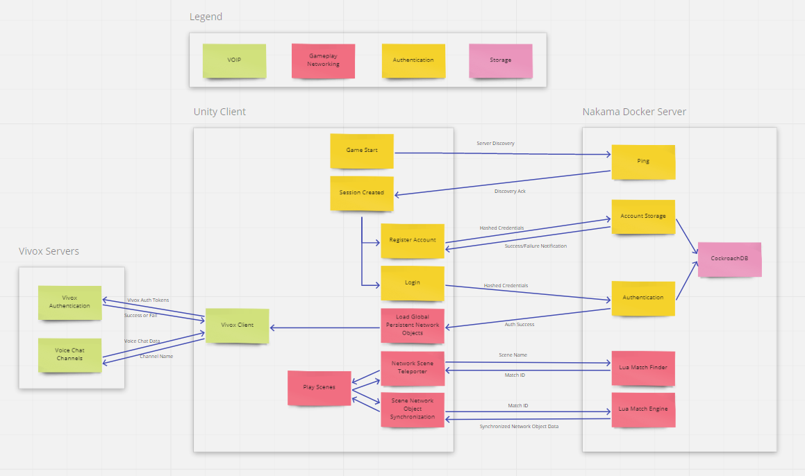

# Nowhere Know-How Multiplayer Core

    

## Set up
This code has external dependencies. Install these first by following the instructions in the links below.
- [Unity](https://unity.com/)
- [Docker](https://www.docker.com/get-started)
- Install [Vivox for Unity](https://assetstore.unity.com/packages/tools/audio/vivox-voice-and-text-chat-148188) from the Asset Store through Unity
    - Verify installation by checking that the Assets/Vivox/Plugins directory is not empty.

## Get your own keys and credentials
- Sign up for a developer account with [Vivox](https://developer.vivox.com/) and create a Sandbox Environment. Gather the following keys.
    - Environment
        - API End-Point
        - Domain
    - API Keys
        - Issuer
        - Secret Key

## Run Instructions
- Toolbar -> Build -> Development
- Toolbar -> Run -> Server -> Start Server
- Set Master Scene to server discovery scene from File -> Scene Autoload -> Select Master Scene
- Click Play in editor
- Open Build and Run Game
- Create accounts
- Log in

## Architecture

    

## Features
- Server discovery
- Register new accounts
- Login to game with email and credentials
- Multiplayer movement
- Multiplayer scene changing
- Persistent scene instancing
- Logout
- Player Location Save on logout
- Voice Communication based on scene